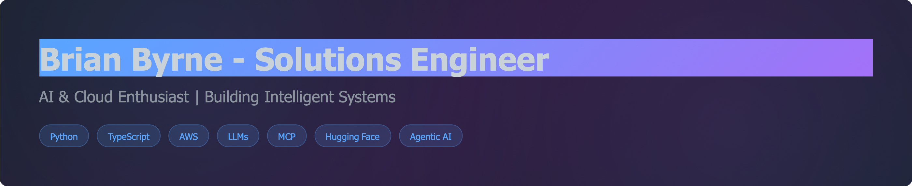

## ⚡ About Me

Solutions Engineer with a passion for building intelligent systems and modern cloud architectures. Currently exploring the intersection of AI and practical engineering solutions using Pythin, Typescript and Rust. In another life I was a C++/C#/.NET Systems engineer. 👀 

## 🚀 Current Focus

<pre>
<b>LLM Coding:</b>      <b>Claude, Copilot, Gemini, Grok, Cursor, Kiro, Codex 👀 </b>
<b>Cloud:</b>           Learning AWS architecture and deployment patterns
<b>Languages:</b>       TypeScript for robust applications, Python for AI/ML workflows
<b>AI & LLMs:</b>       Building with large language models and agentic AI systems
<b>MCP:</b>             Exploring AI integration patterns
<b>Hugging Face:</b>    Working with transformers and open-source ML models
</pre>

## 🛠️ Tech Stack

<pre>
<b>Languages:</b>     🐍 Python | 📘 TypeScript | 🎵 C# | 🦀 Rust | ⚙️ C++
<b>Cloud:</b>         AWS | Azure | GCP
<b>AI/ML:</b>         LLMs | Hugging Face | MCP
<b>Development:</b>   Agentic AI Coding | API Design
<b>Build:</b>         Github Actions | Azure Pipelines | Docker
<b>Tools:</b>         git, VSCode, llm agents, linux  
</pre>

## 🎯 Portfolio

<pre>
<b>Website:</b>       http://www.brianbyrne.net
<b>GitHub:</b>        https://github.com/bhrionn
<b>Podcast:</b>       https://bhrionn.podbean.com
<b>Training:</b>      http://www.youracclaim.com/users/brian-byrne/
<b>Books:</b>         https://www.amazon.com/author/bbyrne1
</pre>

## 🤖 Meet the Team

Here are the details of my bot team that I work with. Assign issues, PR, and eviews to various bots helps speed up work and development. Needless to say these agents are in the IDE for additional work.

Click here >> [Bot Team Details](./TeamBot.md)

## 📫 Let's Connect

✅ Always interested in discussing AI applications, cloud architecture, and innovative engineering solutions. Currently looking for an opportunity targeting 🐍 Python, 🦀 Rust , 📘 TypeScript developing AI LLM cli's ✨  👀

---

✨ *Building the future, one API call at a time* ✨
